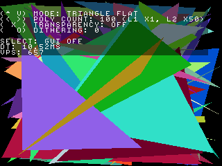
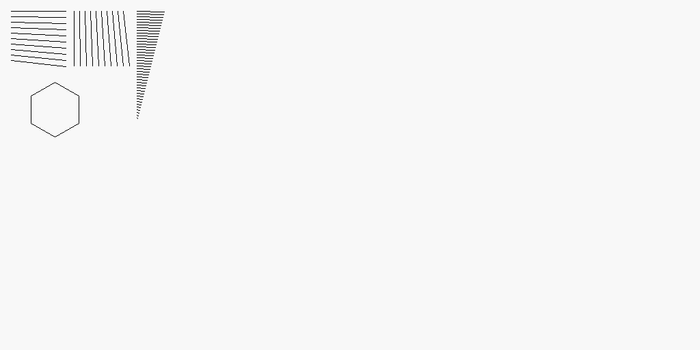
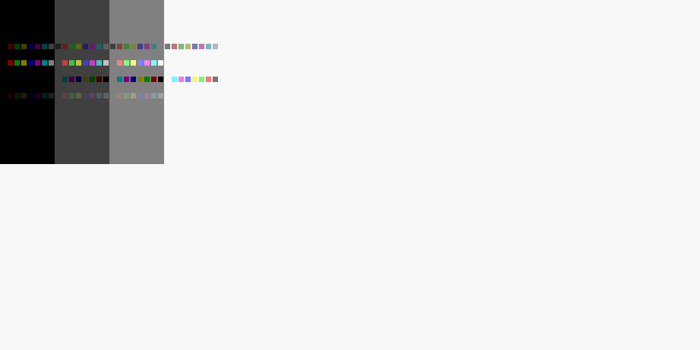
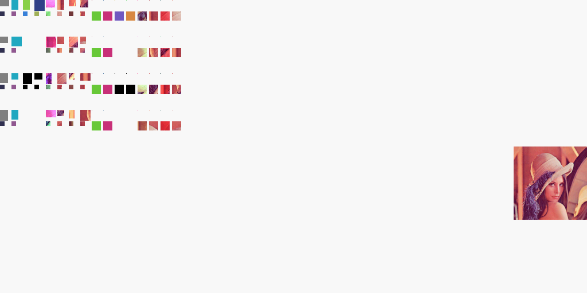
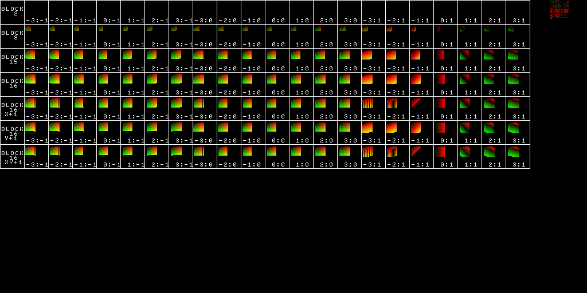

# ps1-tests

Collection of PlayStation 1 tests for emulator development and hardware verification

## Tests

### CD-ROM

Name                     | Description
-------------------------|------------
disc-swap                | Program to observe behavior of CD-ROM controller when opening/closing the drive cover.
getloc                   | Program to test the seeking/reading stat bits of the controller and Getloc commands

### CPU

Name                     | Description
-------------------------|------------
access-time              | Test CPU access time to different parts of memory map
code-in-scratchpad       | **(Not finished)** Check whether code execution from Scratchpad is possible 

### DMA

Name                     | Description
-------------------------|------------
otc-test                 | DMA Channel 6 (OTC aka Ordering Table clear) unit tests

### GPU

Name                     | Description
-------------------------|------------
bandwidth                | Measure GPU/VRAM bandwidth
benchmark                | GPU test to benchmark rasterizer for various commands
clipping                 | Test Draw Area/Clipping GP0(0xE3), GP0(0xE4) using rectangle and quad
gp0-e1                   | Check if GP0_E1, GPUSTAT and polygon render uses the same register internally
lines                    | Draws lines using different modes - for verifying Bresenham implementation, color blending, polyline handling
mask-bit                 | Check Mask bit behavior during VRAM copy operations
quad                     | Semi-transparent polygon commands - for testing fill rules and transparency handling
rectangles               | Draws all combinations of Rectangle commands
texture-overflow         | Draws textured rectangle with UV overflowing VRAM width
transparency             | Draws rectangles with 4 semi-transparent blending modes
triangle                 | Draws Gouroud shaded equilateral triangle 
vram-to-vram-overlap     | Test GP0(80) VRAM-VRAM copy behaviour in overlapping rects
version-detect           | Uses GP1(0x10) and GP0(0xE1) to detect GPU version

### GTE

Name                     | Description
-------------------------|------------
gte-fuzz                 | Executes GTE opcodes with random parameters, can be used to verify against real console

### MDEC

Name                     | Description
-------------------------|------------
mdec                     | Framework for testing MDEC decoder, default values uses DMA for all transfers, but it can be reconfigured for PIO as well (needs manual recompilation)

### SPU

Name                     | Description
-------------------------|------------
memory-transfer          | Test DMA and regular IO transfers to SPU RAM
ram-sandbox              | SPU memory access sandbox (used for memory-transfer test development)
stereo                   | Play samples on first two voices 
test                     | Check SPU behavior (data is lost randomly on 32bit access, ok on 16bit)
toolbox                  | SPU register preview and simple voice playback tool   

### Timer

Name                     | Description
-------------------------|------------
timers                   | Run Timer0,1,2 using various clock sources and sync modes and time them using busy loops and vblank interrupt

Note: Make sure your PS-EXE loaded does set default value for Stack Pointer - these .exes has SP set to 0.

## Tools

Name                     | Description
-------------------------|------------
diffvram                 | Diff two images and write diff png if image contents aren't exactly the same

## Download

[Latest release](https://github.com/JaCzekanski/ps1-tests/releases/latest)

## Examples








## Build

```
docker run -it -v $(pwd):/build jaczekanski/psn00bsdk:latest make
```
