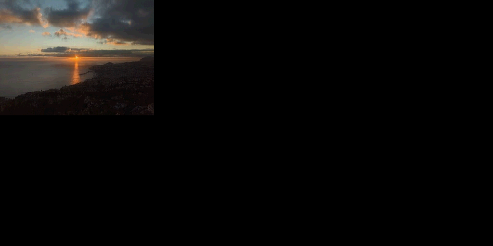

# ps1-tests

Collection of PlayStation 1 tests for emulator development and hardware verification

# Download

[Latest release](https://github.com/JaCzekanski/ps1-tests/releases/latest)

## Tests

### CD-ROM

Name                     | Description
-------------------------|------------
disc-swap                | Program to observe behavior of CD-ROM controller when opening/closing the drive cover.
getloc                   | Program to test the seeking/reading stat bits of the controller and Getloc commands
terminal                 | UART terminal for low level CDROM interaction

### CPU

Name                     | Description
-------------------------|------------
access-time              | Test CPU access time to different parts of memory map
code-in-io               | Check whether code execution from Scratchpad as various IO ports is possible 
cop                      | Check how CPU behave when accessing missing/disabled coprocessors

### DMA

Name                     | Description
-------------------------|------------
chain-looping            | Self referencing GPU OT chain test
chopping                 | Check SyncMode0 chopping behaviour using GPU VRAM DMA
otc-test                 | DMA Channel 6 (OTC aka Ordering Table clear) unit tests

### GPU

Name                     | Description
-------------------------|------------
animated-triangle        | Double buffered rotating triangle
bandwidth                | Measure GPU/VRAM bandwidth
benchmark                | GPU test to benchmark rasterizer for various commands
clut-cache               | CLUT (Palette) cache behavior test
clipping                 | Test Draw Area/Clipping GP0(0xE3), GP0(0xE4) using rectangle and quad
gp0-e1                   | Check if GP0_E1, GPUSTAT and polygon render uses the same register internally
lines                    | Draws lines using different modes - for verifying Bresenham implementation, color blending, polyline handling
mask-bit                 | Check Mask bit behavior during VRAM copy operations
quad                     | Semi-transparent polygon commands - for testing fill rules and transparency handling
rectangles               | Draws all combinations of Rectangle commands
texture-flip             | Check gp0_e1.13 and gp0_e1.12 texture flip behaviour
texture-overflow         | Draws textured rectangle with UV overflowing VRAM width
transparency             | Draws rectangles with 4 semi-transparent blending modes
triangle                 | Draws Gouroud shaded equilateral triangle 
uv-interpolate           | Check uv/color interpolation accuracy by drawing quads with width in range of 0 - 255
vram-to-vram-overlap     | Test GP0(80) VRAM-VRAM copy behaviour in overlapping rects
version-detect           | Uses GP1(0x10) and GP0(0xE1) to detect GPU version

### GTE

Name                     | Description
-------------------------|------------
gte-fuzz                 | Executes GTE opcodes with random parameters, can be used to verify against real console
test-all                 | Test all register/opcodes, generated by gte-fuzz

### MDEC

Name                     | Description
-------------------------|------------
4bit                     | ♥ Decode single 8x8 block in 4bit mode (sanitized bitstream)
8bit                     | ♥ Decode single 8x8 block in 8bit mode (sanitized bitstream)
frame                    | Framework for testing MDEC decoder, default values uses DMA for all transfers, but it can be reconfigured for PIO as well (requires manual recompilation). Two executables for 15 and 24bit modes (using DMA for MDECin, MDECout and GPU)
movie                    | Simple MDEC in-ram bitstream player (currently 200 256x240 frames at @ 10FPS)
step-by-step-log         | Manually feeds the MDEC data and monitors the MDEC status register at every step. 

### SPU

Name                     | Description
-------------------------|------------
memory-transfer          | Test DMA and regular IO transfers to SPU RAM
ram-sandbox              | SPU memory access sandbox (used for memory-transfer test development)
stereo                   | Play samples on first two voices 
test                     | Check SPU behavior (data is lost randomly on 32bit access, ok on 16bit)
toolbox                  | SPU register preview and simple voice playback tool   

### Timer

Name                     | Description
-------------------------|------------
timers                   | Run Timer0,1,2 using various clock sources and sync modes and time them using busy loops and vblank interrupt

Note: Make sure your PS-EXE loaded does set default value for Stack Pointer - these .exes has SP set to 0.

## Tools

Name                     | Description
-------------------------|------------
diffvram                 | Diff two images and write diff png if image contents aren't exactly the same

## Examples





## Build

```
docker run -it -v $(pwd):/build jaczekanski/psn00bsdk:latest make
```
